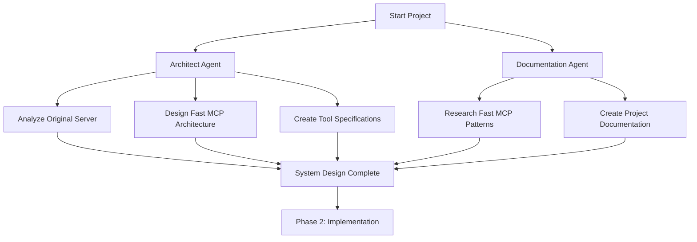
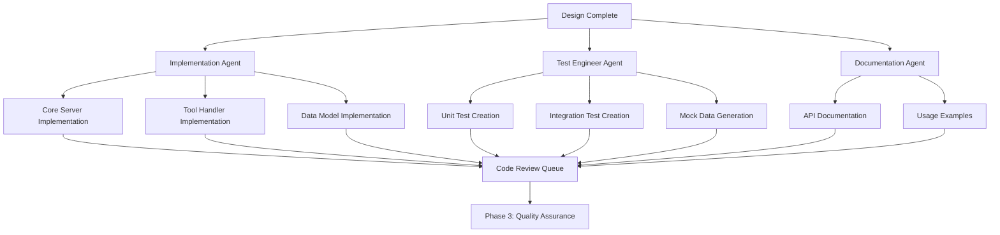
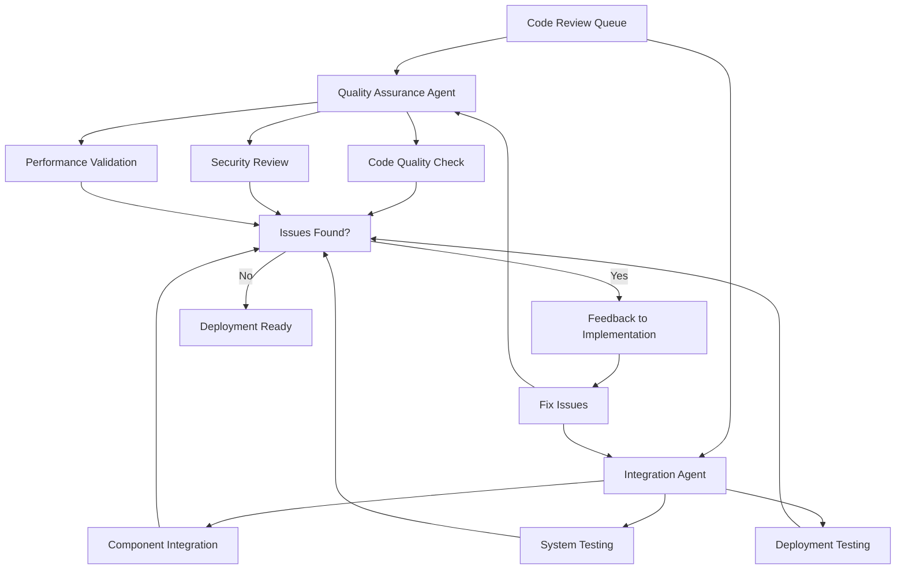
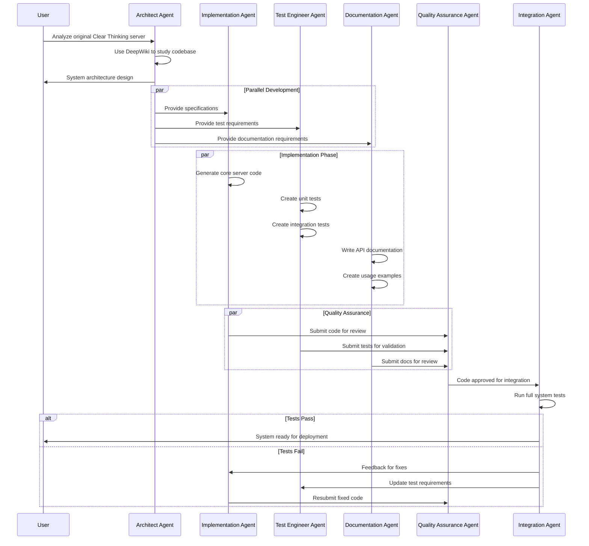

# Clear Thinking MCP Server - Fast MCP Implementation Guide

## Overview

This guide outlines how to rebuild the Clear Thinking MCP server using Fast MCP with a parallel agent-based development approach. The system will use specialized agents to handle design, implementation, testing, and validation in parallel workflows.

## Agent Architecture

### Core Development Agents

#### 1. **Architect Agent** (`architect-agent`)
- **Purpose**: System design and API specification
- **Capabilities**: 
  - Analyze existing server structure
  - Design Fast MCP architecture
  - Create tool specifications
  - Define interfaces and data models
- **Tools Needed**: DeepWiki, Context7, Sequential Thinking

#### 2. **Implementation Agent** (`impl-agent`)
- **Purpose**: Core code generation
- **Capabilities**:
  - Generate Fast MCP server code
  - Implement tool handlers
  - Create data validation logic
  - Handle server configuration
- **Tools Needed**: Context7, Design Patterns, Programming Paradigms

#### 3. **Test Engineer Agent** (`test-agent`)
- **Purpose**: Comprehensive test suite creation
- **Capabilities**:
  - Unit test generation
  - Integration test creation
  - Mock data generation
  - Test coverage validation
- **Tools Needed**: TDD Test Generator, Scientific Method

#### 4. **Documentation Agent** (`docs-agent`)
- **Purpose**: Documentation and usage guides
- **Capabilities**:
  - API documentation
  - Usage examples
  - Installation guides
  - Troubleshooting docs
- **Tools Needed**: Library Guide Writer, Structured Argumentation

#### 5. **Quality Assurance Agent** (`qa-agent`)
- **Purpose**: Code review and validation
- **Capabilities**:
  - Code quality checks
  - Performance validation
  - Security review
  - Standards compliance
- **Tools Needed**: NextJS Frontend Validator (adapted), Shadcn Theme Auditor (adapted)

#### 6. **Integration Agent** (`integration-agent`)
- **Purpose**: End-to-end system integration
- **Capabilities**:
  - Component integration
  - System testing
  - Deployment validation
  - Error handling verification
- **Tools Needed**: Automation Workflow Engineer, Web Search Deployment Planner

## Development Workflow

### Phase 1: Analysis and Design (Parallel)



### Phase 2: Parallel Implementation



### Phase 3: Quality Assurance and Integration



## Sequence Diagram



## Detailed Implementation Plan

### 1. Architect Agent Tasks

#### Initial Analysis
```typescript
// Agent Instructions:
1. Use DeepWiki to analyze chirag127/Clear-Thought-MCP-server
2. Map all 11 tools and their functionality
3. Identify Fast MCP equivalent patterns
4. Design modular architecture for scalability
```

#### Architecture Design
```typescript
// Deliverables:
- Fast MCP server structure
- Tool handler interface definitions
- Data model specifications
- Configuration patterns
- Error handling strategy
```

### 2. Implementation Agent Tasks

#### Core Server Implementation
**Python FastMCP Server Structure:**
```python
# Clear Thinking FastMCP Server Structure:
clear_thinking_server/
├── server.py              # Main FastMCP server entry point
├── tools/                 # Tool implementations
│   ├── __init__.py
│   ├── sequential_thinking.py
│   ├── mental_model.py
│   ├── collaborative_reasoning.py
│   ├── decision_framework.py
│   ├── metacognitive_monitoring.py
│   ├── scientific_method.py
│   ├── structured_argumentation.py
│   ├── visual_reasoning.py
│   ├── design_pattern.py
│   ├── programming_paradigm.py
│   └── debugging_approach.py
├── models/                # Pydantic data models
│   ├── __init__.py
│   ├── thought_models.py
│   ├── reasoning_models.py
│   └── base_models.py
├── processors/            # Core logic processors
│   ├── __init__.py
│   ├── thought_processor.py
│   ├── reasoning_processor.py
│   └── validation_processor.py
├── utils/                 # Helper functions
│   ├── __init__.py
│   ├── formatters.py
│   └── validators.py
├── tests/                 # Test suite
├── requirements.txt       # Dependencies
└── README.md             # Documentation
```

#### Python FastMCP Tool Implementation Patterns

**Main Server Setup:**
```python
# server.py - Main FastMCP Server
from fastmcp import FastMCP
from tools import (
    sequential_thinking, mental_model, collaborative_reasoning,
    decision_framework, metacognitive_monitoring, scientific_method,
    structured_argumentation, visual_reasoning, design_pattern,
    programming_paradigm, debugging_approach
)

# Create the FastMCP server instance
mcp = FastMCP(
    name="Clear Thinking MCP Server",
    instructions="""
    A comprehensive cognitive framework server providing 11 tools for 
    systematic thinking, problem-solving, and decision-making.
    Use these tools to enhance reasoning across diverse cognitive styles.
    """
)

# Register all tools
mcp.mount("thinking", sequential_thinking.create_server())
mcp.mount("models", mental_model.create_server())
mcp.mount("reasoning", collaborative_reasoning.create_server())
# ... mount other tools

if __name__ == "__main__":
    mcp.run()  # Default: STDIO transport
```

**Sequential Thinking Tool Example:**
```python
# tools/sequential_thinking.py
from fastmcp import FastMCP
from pydantic import BaseModel, Field
from typing import Optional
from processors.thought_processor import ThoughtProcessor

class SequentialThinkingInput(BaseModel):
    thought: str = Field(description="The current thought or insight")
    thoughtNumber: int = Field(description="Current thought number (1-based)")
    totalThoughts: int = Field(description="Estimated total thoughts needed")
    nextThoughtNeeded: bool = Field(description="Whether more thinking is required")
    isRevision: Optional[bool] = Field(None, description="Is this revising a previous thought")
    revisesThought: Optional[int] = Field(None, description="Which thought this revises")
    branchFromThought: Optional[int] = Field(None, description="Thought to branch from")
    branchId: Optional[str] = Field(None, description="Branch identifier")
    needsMoreThoughts: Optional[bool] = Field(None, description="Need more than estimated")

def create_server() -> FastMCP:
    server = FastMCP(name="Sequential Thinking")
    processor = ThoughtProcessor()
    
    @server.tool
    def sequential_thinking(input: SequentialThinkingInput) -> str:
        """
        Dynamic and reflective problem-solving through structured thoughts.
        
        This tool helps analyze problems through a flexible thinking process 
        that can adapt and evolve. Each thought can build on, question, or 
        revise previous insights as understanding deepens.
        """
        try:
            # Process the thought with revision/branching support
            result = processor.process_thought(
                thought=input.thought,
                thought_number=input.thoughtNumber,
                total_thoughts=input.totalThoughts,
                next_needed=input.nextThoughtNeeded,
                is_revision=input.isRevision,
                revises_thought=input.revisesThought,
                branch_from=input.branchFromThought,
                branch_id=input.branchId,
                needs_more=input.needsMoreThoughts
            )
            
            return processor.format_output(result)
            
        except Exception as e:
            return f"Error processing thought: {str(e)}"
    
    return server
```

**Mental Model Tool Example:**
```python
# tools/mental_model.py
from fastmcp import FastMCP
from pydantic import BaseModel, Field
from typing import List, Optional, Literal
from processors.reasoning_processor import MentalModelProcessor

MentalModelType = Literal[
    "first_principles", "opportunity_cost", "error_propagation",
    "rubber_duck", "pareto_principle", "occams_razor"
]

class MentalModelInput(BaseModel):
    modelName: MentalModelType = Field(description="The mental model to apply")
    problem: str = Field(description="The problem to analyze")
    steps: Optional[List[str]] = Field([], description="Analysis steps")
    reasoning: Optional[str] = Field("", description="Reasoning process")
    conclusion: Optional[str] = Field("", description="Final conclusion")

def create_server() -> FastMCP:
    server = FastMCP(name="Mental Models")
    processor = MentalModelProcessor()
    
    @server.tool
    def mental_model(input: MentalModelInput) -> str:
        """
        Apply structured mental models to problem-solving.
        
        Supports various mental models:
        - First Principles Thinking: Break down to fundamental truths
        - Opportunity Cost Analysis: What are you giving up?
        - Error Propagation Understanding: How do small errors compound?
        - Rubber Duck Debugging: Explain step-by-step to someone else
        - Pareto Principle: Focus on the vital few (80/20 rule)
        - Occam's Razor: Simplest explanation with fewest assumptions
        """
        try:
            result = processor.apply_model(
                model_type=input.modelName,
                problem=input.problem,
                steps=input.steps,
                reasoning=input.reasoning,
                conclusion=input.conclusion
            )
            
            return processor.format_model_output(input.modelName, result)
            
        except Exception as e:
            return f"Error applying mental model: {str(e)}"
    
    return server
```

### 3. Test Engineer Agent Tasks

#### Test Structure
```typescript
tests/
├── unit/                  // Unit tests for each tool
│   ├── sequential-thinking.test.ts
│   ├── mental-model.test.ts
│   └── ...
├── integration/           // Integration tests
│   ├── server.test.ts
│   └── tool-interactions.test.ts
├── mocks/                 // Mock data and fixtures
└── utils/                 // Test utilities
```

#### Test Patterns
```typescript
// Unit Test Example
describe('Sequential Thinking Tool', () => {
  test('should process valid thought sequence', async () => {
    const input = {
      thought: 'Initial analysis',
      thoughtNumber: 1,
      totalThoughts: 3,
      nextThoughtNeeded: true
    };
    
    const result = await sequentialThinkingTool.handler(input);
    expect(result.status).toBe('success');
  });
});
```

### 4. Documentation Agent Tasks

#### Documentation Structure
```markdown
docs/
├── README.md              // Main documentation
├── api/                   // API reference
│   ├── tools.md
│   └── schemas.md
├── examples/              // Usage examples
├── deployment/            // Deployment guides
└── troubleshooting/       // Common issues
```

### 5. Quality Assurance Agent Tasks

#### Review Checklist
- [ ] Code follows Fast MCP best practices
- [ ] All tools have comprehensive tests
- [ ] Input validation is robust
- [ ] Error handling is consistent
- [ ] Documentation is complete
- [ ] Performance benchmarks pass
- [ ] Security vulnerabilities addressed

### 6. Integration Agent Tasks

#### Integration Tests
```typescript
// End-to-end test example
describe('Complete Workflow', () => {
  test('should handle complex multi-tool reasoning', async () => {
    // Test sequential thinking -> mental model -> decision framework
    const server = await createTestServer();
    
    // Execute tool chain
    const result1 = await server.executeTool('sequential-thinking', input1);
    const result2 = await server.executeTool('mental-model', input2);
    const result3 = await server.executeTool('decision-framework', input3);
    
    // Validate complete workflow
    expect(result3.finalRecommendation).toBeDefined();
  });
});
```

## Agent Coordination Strategy

### 1. Shared Context Management
```typescript
// All agents share context through:
- Shared documentation repository
- Code review system
- Test result dashboard
- Issue tracking system
```

### 2. Communication Protocols
```typescript
// Agent communication via:
- Structured feedback messages
- Code review comments
- Test result reports
- Documentation updates
```

### 3. Conflict Resolution
```typescript
// When agents disagree:
1. Escalate to human oversight
2. Use voting mechanism for technical decisions
3. Defer to domain expertise (e.g., Test Agent for testing decisions)
4. Document all decisions for future reference
```

## Technology Stack

### Fast MCP Framework

#### Python FastMCP (jlowin/fastmcp)
```python
# Core dependencies:
- fastmcp: Fast MCP Python framework
- pydantic: Data validation
- httpx: HTTP client for API integration
- asyncio: Async programming support
```

#### TypeScript FastMCP (punkpeye/fastmcp)
```typescript
// Core dependencies:
- fastmcp: Fast MCP TypeScript framework
- zod: Schema validation
- @modelcontextprotocol/sdk: MCP SDK types
- Standard Schema: Validation library support
```

**Note**: This guide focuses on the **Python FastMCP implementation** (jlowin/fastmcp), which is more mature with 666+ code snippets and excellent documentation. The Python version offers superior stability and feature completeness.

### Development Tools

**Python Development Stack (Primary Focus):**
```python
# Core Dependencies:
- fastmcp: Fast MCP Python framework
- pydantic: Data validation and serialization
- httpx: Async HTTP client for testing
- asyncio: Async programming support

# Testing:
- pytest: Python testing framework
- pytest-asyncio: Async test support
- pytest-mock: Mocking utilities
- coverage: Code coverage analysis

# Quality & Formatting:
- black: Code formatting
- ruff: Fast Python linter
- mypy: Type checking
- pre-commit: Git hooks

# Development:
- uvx: Python package runner
- rich: Enhanced terminal output
- loguru: Advanced logging
```

## Deployment Strategy

### 1. Development Environment

**Python FastMCP Development:**
```bash
# Setup virtual environment
python -m venv venv
source venv/bin/activate  # On Windows: venv\Scripts\activate

# Install dependencies
pip install fastmcp pydantic httpx pytest black ruff mypy

# Development commands
python server.py              # Run server directly (STDIO)
python -m fastmcp run server.py  # Alternative run method

# Testing
pytest                        # Run all tests
pytest --watch               # Watch mode testing
pytest --cov=.               # Coverage analysis

# Code quality
black .                      # Format code
ruff check .                 # Lint code
ruff check . --fix          # Auto-fix linting issues
mypy .                      # Type checking

# Development with MCP Inspector
uvx mcp-inspector --stdio "python server.py"
```

### 2. CI/CD Pipeline
```yaml
# .github/workflows/python-fastmcp.yml
name: Clear Thinking FastMCP CI/CD

on:
  push:
    branches: [ main, develop ]
  pull_request:
    branches: [ main ]

jobs:
  test:
    runs-on: ubuntu-latest
    strategy:
      matrix:
        python-version: [3.9, 3.10, 3.11, 3.12]
    
    steps:
    - uses: actions/checkout@v4
    - name: Set up Python ${{ matrix.python-version }}
      uses: actions/setup-python@v4
      with:
        python-version: ${{ matrix.python-version }}
    
    - name: Install dependencies
      run: |
        python -m pip install --upgrade pip
        pip install fastmcp pydantic httpx pytest black ruff mypy coverage
        pip install -r requirements.txt
    
    - name: Code quality checks
      run: |
        black --check .
        ruff check .
        mypy .
    
    - name: Run tests with coverage
      run: |
        pytest --cov=. --cov-report=xml
    
    - name: Security scanning
      run: |
        pip install bandit safety
        bandit -r .
        safety check
    
    - name: Performance benchmarking
      run: |
        pytest tests/performance/ --benchmark-only

  deploy-staging:
    needs: test
    runs-on: ubuntu-latest
    if: github.ref == 'refs/heads/develop'
    steps:
    - name: Deploy to staging
      run: echo "Deploy to staging environment"

  deploy-production:
    needs: test
    runs-on: ubuntu-latest
    if: github.ref == 'refs/heads/main'
    environment: production
    steps:
    - name: Deploy to production
      run: echo "Deploy to production environment"
```

### 3. Monitoring and Observability
```python
# Python FastMCP Observability Stack:
# Built into FastMCP framework:
- Structured logging with loguru
- Performance metrics collection
- Error tracking and reporting
- Usage analytics via tool calls
- Health checks and status endpoints
- Real-time monitoring capabilities

# Additional monitoring tools:
- Prometheus: Metrics collection
- Grafana: Dashboards and visualization  
- Sentry: Error tracking and alerting
- OpenTelemetry: Distributed tracing
```

## Success Metrics

### Quality Metrics
- [ ] 100% test coverage
- [ ] All linting rules pass
- [ ] No security vulnerabilities
- [ ] Performance within 10% of original server

### Functionality Metrics
- [ ] All 11 tools implemented
- [ ] Feature parity with original server
- [ ] Enhanced error handling
- [ ] Improved documentation

### Process Metrics
- [ ] Parallel development reduces time by 60%
- [ ] Automated quality checks catch 95% of issues
- [ ] Documentation completeness score > 90%

## Risk Mitigation

### Technical Risks
- **Agent coordination failures**: Implement robust communication protocols
- **Quality assurance gaps**: Multiple validation layers
- **Integration issues**: Comprehensive end-to-end testing

### Process Risks
- **Scope creep**: Clear agent responsibilities
- **Timeline delays**: Parallel execution with clear dependencies
- **Quality degradation**: Automated quality gates

## Conclusion

This agent-based approach to rebuilding the Clear Thinking MCP server provides:

1. **Parallel Development**: Faster delivery through concurrent work streams
2. **Quality Assurance**: Multiple specialized agents ensure high quality
3. **Comprehensive Testing**: Dedicated test engineering from day one
4. **Documentation First**: Complete documentation alongside development
5. **Continuous Integration**: Automated quality and integration checks

The result will be a more robust, well-tested, and maintainable Fast MCP server that matches or exceeds the functionality of the original Clear Thinking server.