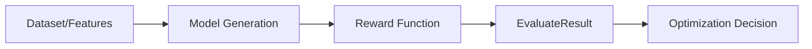

# Reward-Kit Integration Guide for PyClarity

## Overview

This guide provides comprehensive documentation for integrating `reward-kit` into PyClarity's optimization loop. Reward-kit is a powerful framework for defining, testing, and deploying reward functions for Large Language Model (LLM) evaluation and reinforcement learning fine-tuning.

## Table of Contents

1. [Introduction to Reward-Kit](#introduction-to-reward-kit)
2. [Core Concepts](#core-concepts)
3. [Installation and Setup](#installation-and-setup)
4. [Creating Reward Functions](#creating-reward-functions)
5. [Integrating with PyClarity's Optimization Loop](#integrating-with-pyclaritys-optimization-loop)
6. [Advanced Usage](#advanced-usage)
7. [Examples](#examples)
8. [Best Practices](#best-practices)

## Introduction to Reward-Kit

Reward-kit provides:
- Easy-to-use `@reward_function` decorator for defining evaluation logic
- Local testing capabilities for rapid development
- Flexible evaluation with single or multiple custom metrics
- Seamless deployment to platforms like Fireworks AI
- Comprehensive CLI for managing reward functions
- Direct integration with HuggingFace datasets
- TRL (Transformer Reinforcement Learning) integration

## Core Concepts

### 1. Reward Functions

At the heart of reward-kit are reward functions - Python functions decorated with `@reward_function` that evaluate model outputs:

```python
from reward_kit import reward_function, EvaluateResult, MetricResult
from reward_kit.models import Message
from typing import List, Dict, Any, Optional, Union

@reward_function
def quality_evaluator(
    messages: Union[List[Message], List[Dict[str, Any]]],
    ground_truth: Optional[Dict[str, Any]] = None,
    **kwargs
) -> EvaluateResult:
    """Evaluate the quality of generated features."""
    # Your evaluation logic here
    return EvaluateResult(
        score=0.95,
        reason="High quality output",
        metrics={}
    )
```

### 2. EvaluateResult

The core return type containing:
- `score`: Float between 0.0 and 1.0
- `reason`: Explanation of the score
- `metrics`: Dictionary of MetricResult objects for detailed scoring

### 3. Data Flow



## Installation and Setup

```bash
# Install reward-kit with TRL support
uv add "reward-kit[trl]"

# Set up Fireworks authentication (if using deployment features)
export FIREWORKS_API_KEY="your_api_key"
export FIREWORKS_ACCOUNT_ID="your_account_id"
```

## Creating Reward Functions

### Basic Reward Function

```python
from reward_kit import reward_function, EvaluateResult, MetricResult
from typing import List, Dict, Any, Optional

@reward_function
def feature_quality_reward(
    messages: List[Dict[str, Any]],
    ground_truth: Optional[Dict[str, Any]] = None,
    **kwargs
) -> EvaluateResult:
    """
    Evaluate feature quality based on PyClarity criteria.
    """
    # Extract the generated features from the last message
    if not messages or len(messages) == 0:
        return EvaluateResult(
            score=0.0,
            reason="No messages provided",
            metrics={}
        )
    
    last_message = messages[-1]
    content = last_message.get("content", "") if isinstance(last_message, dict) else last_message.content
    
    # Evaluation logic
    score = 0.0
    metrics = {}
    
    # Check for required elements
    has_core_features = "core" in content
    has_supporting = "supporting" in content
    has_integration = "integration" in content
    
    # Calculate scores
    completeness_score = sum([has_core_features, has_supporting, has_integration]) / 3.0
    
    metrics["completeness"] = MetricResult(
        score=completeness_score,
        success=completeness_score > 0.7,
        reason=f"Feature categories coverage: {completeness_score:.1%}"
    )
    
    # Overall score
    score = completeness_score
    
    return EvaluateResult(
        score=score,
        reason=f"Feature quality score: {score:.1%}",
        metrics=metrics
    )
```

### Multi-Metric Reward Function

```python
@reward_function
def comprehensive_feature_evaluator(
    messages: List[Dict[str, Any]],
    ground_truth: Optional[Dict[str, Any]] = None,
    quality_threshold: float = 0.8,
    **kwargs
) -> EvaluateResult:
    """
    Comprehensive evaluation with multiple metrics.
    """
    import json
    import re
    
    # Extract features
    last_message = messages[-1]
    content = last_message.get("content", "") if isinstance(last_message, dict) else last_message.content
    
    # Try to parse JSON features
    try:
        json_match = re.search(r'\{[\s\S]*\}', content)
        if json_match:
            features = json.loads(json_match.group())
        else:
            features = {}
    except:
        features = {}
    
    # Multiple evaluation metrics
    metrics = {}
    
    # 1. Completeness
    required_categories = ["core", "supporting", "integration", "analytics", "future"]
    present_categories = [cat for cat in required_categories if cat in features]
    completeness_score = len(present_categories) / len(required_categories)
    
    metrics["completeness"] = MetricResult(
        score=completeness_score,
        success=completeness_score >= 0.8,
        reason=f"Categories: {len(present_categories)}/{len(required_categories)}"
    )
    
    # 2. Feature Count
    total_features = sum(len(features.get(cat, [])) for cat in features)
    feature_count_score = min(total_features / 20.0, 1.0)  # Target 20+ features
    
    metrics["feature_count"] = MetricResult(
        score=feature_count_score,
        success=total_features >= 15,
        reason=f"Total features: {total_features}"
    )
    
    # 3. Quality Indicators
    quality_keywords = ["ai-powered", "intelligent", "automated", "real-time", "adaptive"]
    quality_count = sum(
        1 for cat in features.values() 
        for feature in cat 
        if any(kw in str(feature).lower() for kw in quality_keywords)
    )
    quality_score = min(quality_count / 5.0, 1.0)  # Target 5+ quality features
    
    metrics["innovation"] = MetricResult(
        score=quality_score,
        success=quality_count >= 3,
        reason=f"Innovative features: {quality_count}"
    )
    
    # Combined score
    final_score = (
        completeness_score * 0.4 +
        feature_count_score * 0.3 +
        quality_score * 0.3
    )
    
    return EvaluateResult(
        score=final_score,
        reason=f"Comprehensive evaluation: {final_score:.1%}",
        metrics=metrics
    )
```

## Integrating with PyClarity's Optimization Loop

### Modified Optimizer Using Reward-Kit

```python
#!/usr/bin/env python3
"""
PyClarity LLM Optimizer Enhanced with Reward-Kit
"""

import json
import time
from datetime import datetime
from pathlib import Path
from typing import Any, Dict, List

from groq import Groq
from loguru import logger
from reward_kit import reward_function, EvaluateResult, MetricResult
from reward_kit.models import Message


class RewardKitOptimizer:
    """LLM Optimizer using reward-kit for evaluation"""
    
    def __init__(self):
        self.iteration = 0
        self.feature_list = {}
        self.improvement_history = []
        self.client = Groq()
        
        # Define reward functions
        self.feature_evaluator = self._create_feature_evaluator()
        
    @staticmethod
    @reward_function
    def _create_feature_evaluator():
        """Create the main feature evaluation reward function."""
        def evaluate(
            messages: List[Dict[str, Any]],
            ground_truth: Optional[Dict[str, Any]] = None,
            **kwargs
        ) -> EvaluateResult:
            # Implementation from above
            pass
        return evaluate
    
    def evaluate_features_with_reward_kit(self, features: Dict[str, List[Dict[str, Any]]]) -> Dict[str, Any]:
        """
        Evaluate features using reward-kit framework.
        """
        # Convert features to message format for reward function
        messages = [
            {"role": "system", "content": "Feature evaluation system"},
            {"role": "assistant", "content": json.dumps(features, indent=2)}
        ]
        
        # Run reward function
        result = self.feature_evaluator(messages)
        
        # Convert to optimizer format
        return {
            "overall_score": result.score,
            "scores": {
                metric_name: metric.score 
                for metric_name, metric in result.metrics.items()
            },
            "detailed_feedback": {
                metric_name: metric.reason
                for metric_name, metric in result.metrics.items()
            },
            "suggestions": self._generate_suggestions_from_metrics(result.metrics),
            "improvement_rate": self._calculate_improvement_rate(result.score)
        }
    
    def run_optimization_loop(self, max_iterations: int = 10):
        """Main optimization loop using reward-kit."""
        logger.info("Starting Reward-Kit Enhanced Optimizer")
        
        while self.iteration < max_iterations:
            self.iteration += 1
            
            # Generate features
            new_features = self.generate_features_with_llm()
            
            # Evaluate with reward-kit
            evaluation_result = self.evaluate_features_with_reward_kit(new_features)
            
            # Optimize based on evaluation
            self.feature_list = self.optimize_features_based_on_evaluation(
                new_features, evaluation_result
            )
            
            # Log results
            self.log_iteration_results(evaluation_result)
            
            # Check convergence
            if self.has_converged():
                break
                
        logger.info("Optimization complete!")
```

### Using TRL Integration for Reinforcement Learning

```python
from reward_kit.integrations.trl import create_trl_adapter

def create_feature_optimization_trainer():
    """
    Create a TRL trainer for feature optimization using reward-kit.
    """
    # Create reward function adapter for TRL
    reward_adapter = create_trl_adapter(
        reward_fn=comprehensive_feature_evaluator,
        dataset_to_reward_kwargs_map={},
        static_reward_kwargs={"quality_threshold": 0.85}
    )
    
    # Use with GRPO or PPO trainer
    from trl import GRPOConfig, GRPOTrainer
    
    training_args = GRPOConfig(
        output_dir="./feature-optimization-output",
        learning_rate=5e-5,
        num_train_epochs=3,
        max_completion_length=2048,
        per_device_train_batch_size=1,
    )
    
    # Create trainer (model and dataset setup omitted for brevity)
    trainer = GRPOTrainer(
        model=model,
        reward_funcs=[reward_adapter],
        args=training_args,
        train_dataset=feature_dataset,
    )
    
    return trainer
```

## Advanced Usage

### 1. Deployment for Production Use

```python
# Deploy to Fireworks AI
from reward_kit.evaluation import create_evaluation

evaluator = create_evaluation(
    evaluator_id="pyclarity-feature-evaluator",
    metric_folders=["feature_quality=./metrics/feature_quality"],
    display_name="PyClarity Feature Quality Evaluator",
    description="Evaluates AI-generated feature specifications",
    force=True
)
```

### 2. Local Testing with CLI

```bash
# Test with sample data
reward-kit preview --metrics-folders "feature_eval=./metrics" --samples ./test_features.jsonl

# Run comprehensive evaluation
reward-kit run --config-name feature_eval --config-path ./conf
```

### 3. Integration with Datasets

```yaml
# conf/feature_eval.yaml
defaults:
  - _self_

dataset:
  source_type: "jsonl"
  path: "./feature_proposals.jsonl"
  
generation:
  enabled: true
  model_name: "accounts/fireworks/models/llama-v3p1-70b-instruct"
  
evaluation:
  metrics:
    - name: "feature_quality"
      module: "metrics.feature_quality"
      function: "comprehensive_feature_evaluator"
```

## Examples

### Example 1: Feature Quality Evaluation

```python
# test_feature_evaluation.py
from reward_kit.rewards.function_calling import exact_tool_match_reward
from pyclarity_rewards import feature_quality_reward

# Test data
test_features = {
    "core": [
        {
            "id": "F001",
            "name": "AI-Powered UI Generator",
            "description": "Generates UI components using AI",
            "priority": "high",
            "complexity": "medium",
            "user_value": 9,
            "technical_risk": 3
        }
    ],
    "supporting": [...],
    "integration": [...]
}

# Create messages format
messages = [
    {"role": "system", "content": "Feature evaluation"},
    {"role": "assistant", "content": json.dumps(test_features)}
]

# Evaluate
result = feature_quality_reward(messages)
print(f"Score: {result.score}")
print(f"Reason: {result.reason}")
for metric_name, metric in result.metrics.items():
    print(f"{metric_name}: {metric.score:.2f} - {metric.reason}")
```

### Example 2: Multi-Stage Evaluation Pipeline

```python
def create_evaluation_pipeline():
    """Create a multi-stage evaluation pipeline."""
    
    # Stage 1: Format validation
    @reward_function
    def format_validator(messages, **kwargs):
        # Validate JSON structure
        pass
    
    # Stage 2: Content quality
    @reward_function
    def content_evaluator(messages, **kwargs):
        # Evaluate content quality
        pass
    
    # Stage 3: Innovation scoring
    @reward_function
    def innovation_scorer(messages, **kwargs):
        # Score innovation level
        pass
    
    # Combine stages
    def pipeline(features):
        messages = [{"role": "assistant", "content": json.dumps(features)}]
        
        format_result = format_validator(messages)
        if format_result.score < 0.5:
            return format_result
            
        content_result = content_evaluator(messages)
        innovation_result = innovation_scorer(messages)
        
        # Weighted combination
        final_score = (
            format_result.score * 0.2 +
            content_result.score * 0.5 +
            innovation_result.score * 0.3
        )
        
        return EvaluateResult(
            score=final_score,
            reason="Multi-stage evaluation complete",
            metrics={
                "format": format_result.metrics,
                "content": content_result.metrics,
                "innovation": innovation_result.metrics
            }
        )
    
    return pipeline
```

## Best Practices

### 1. Reward Function Design

- **Single Responsibility**: Each reward function should evaluate one aspect
- **Clear Metrics**: Use meaningful metric names and explanations
- **Normalized Scores**: Always return scores between 0.0 and 1.0
- **Detailed Reasons**: Provide actionable feedback in the reason field

### 2. Error Handling

```python
@reward_function
def robust_evaluator(messages, **kwargs):
    try:
        # Evaluation logic
        score = evaluate_features(messages)
        return EvaluateResult(score=score, reason="Success", metrics={})
    except json.JSONDecodeError:
        return EvaluateResult(
            score=0.0,
            reason="Invalid JSON format",
            metrics={"error": MetricResult(score=0.0, success=False, reason="JSON parse error")}
        )
    except Exception as e:
        return EvaluateResult(
            score=0.0,
            reason=f"Evaluation error: {str(e)}",
            metrics={}
        )
```

### 3. Testing Strategy

1. **Unit Tests**: Test individual reward functions with known inputs
2. **Integration Tests**: Test the full optimization loop
3. **Preview Testing**: Use `reward-kit preview` for rapid iteration
4. **Benchmark Datasets**: Create representative test datasets

### 4. Performance Optimization

- **Batch Evaluation**: Process multiple samples together when possible
- **Caching**: Cache expensive computations within reward functions
- **Async Processing**: Use async reward functions for I/O operations

## Conclusion

Integrating reward-kit into PyClarity provides a robust, scalable framework for evaluating and optimizing AI-generated features. The combination of flexible reward functions, comprehensive metrics, and seamless deployment options makes it ideal for sophisticated optimization loops.

Key benefits:
- **Modularity**: Separate evaluation logic from optimization logic
- **Testability**: Easy to test and validate reward functions
- **Scalability**: Deploy to production with minimal changes
- **Integration**: Works with existing ML frameworks (TRL, HuggingFace)
- **Monitoring**: Built-in metrics and logging for debugging

For more information, refer to the [reward-kit documentation](https://github.com/fw-ai-external/reward-kit) and the examples in this guide.