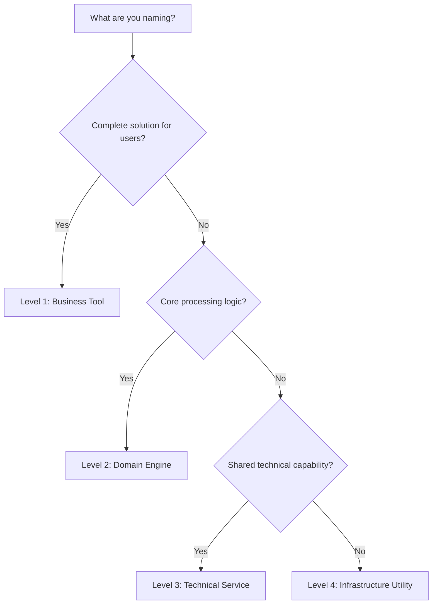

# PyClarity Naming Decision Guide

## Quick Decision Framework

### 1. What Are You Naming?



### 2. Naming Patterns by Type

| Level | Pattern | Example |
|-------|---------|---------|
| Tool | `[Domain][Value][Type]` | `StrategicDecisionAccelerator` |
| Engine | `[Action][Object]er` | `DecisionCrystallizer` |
| Service | `[Capability]Service` | `MonteCarloSimulationService` |
| Utility | `[action]_[object]` | `calculate_weighted_score` |

## Real-World Naming Scenarios

### Scenario 1: "I need something to help teams make better decisions"

**Thought Process:**
1. **Purpose**: Help teams make decisions
2. **Level**: Complete solution → Level 1 (Business Tool)
3. **Domain**: Strategic/Team
4. **Value**: Better/Accelerated decisions
5. **Type**: Accelerator/Optimizer/Intelligence

**Options Generated:**
- `TeamDecisionAccelerator` ✅
- `StrategicDecisionOptimizer` ✅
- `DecisionIntelligenceFramework` ✅
- `TeamDecisionManager` ❌ (avoid "Manager")
- `BetterDecisionMaker` ❌ (avoid qualitative terms)

**Final Choice**: `StrategicDecisionAccelerator`
- **Why**: "Strategic" elevates it beyond just team decisions
- **Why**: "Accelerator" implies speed and efficiency
- **Why**: Follows Level 1 pattern perfectly

### Scenario 2: "I need to analyze different possible outcomes"

**Thought Process:**
1. **Purpose**: Analyze outcomes/scenarios
2. **Level**: Component of a tool → Level 2 (Domain Engine)
3. **Function**: Modeling/Analysis
4. **Object**: Scenarios/Outcomes

**Options Generated:**
- `ScenarioModeler` ✅
- `OutcomeAnalyzer` ✅
- `ScenarioAnalysisEngine` ✅
- `ScenarioManager` ❌ (avoid "Manager")
- `ScenarioHandler` ❌ (too generic)

**Final Choice**: `ScenarioModeler`
- **Why**: "Modeler" implies creation and analysis
- **Why**: Clear, concise, follows pattern
- **Why**: Reusable across different tools

### Scenario 3: "I need to run statistical simulations"

**Thought Process:**
1. **Purpose**: Run simulations
2. **Level**: Technical capability → Level 3 (Service)
3. **Type**: Statistical/Mathematical
4. **Specificity**: Monte Carlo method

**Options Generated:**
- `MonteCarloSimulationService` ✅
- `StatisticalSimulationService` ✅
- `SimulationEngine` ❌ (too generic)
- `MonteCarloRunner` ❌ (informal)
- `MCSimService` ❌ (avoid abbreviations)

**Final Choice**: `MonteCarloSimulationService`
- **Why**: Specific algorithm named
- **Why**: "Service" clearly indicates Level 3
- **Why**: Technical but understandable

### Scenario 4: "I need to calculate scores with weights"

**Thought Process:**
1. **Purpose**: Calculate weighted scores
2. **Level**: Pure function → Level 4 (Utility)
3. **Pattern**: verb_object_qualifier
4. **Clarity**: Self-documenting

**Options Generated:**
- `calculate_weighted_score()` ✅
- `compute_weighted_average()` ✅
- `weighted_score()` ❌ (missing verb)
- `calcScore()` ❌ (abbreviation)
- `getWeightedScore()` ❌ (getter pattern)

**Final Choice**: `calculate_weighted_score()`
- **Why**: Clear verb (calculate)
- **Why**: Specific object (weighted_score)
- **Why**: Follows Python conventions

## Common Naming Dilemmas

### Dilemma 1: "Framework" vs "System" vs "Platform"

**Guidelines:**
- **Framework**: Provides structure and guidelines
  - Example: `MentorshipEvolutionFramework`
- **System**: Complete, integrated solution
  - Example: `RecommendationSystem`
- **Platform**: Foundation for building other tools
  - Example: `AnalyticsPlatform`

**Decision**: Use based on the tool's primary purpose

### Dilemma 2: "Optimizer" vs "Maximizer" vs "Enhancer"

**Guidelines:**
- **Optimizer**: Finding the best configuration
  - Example: `TeamDynamicsOptimizer`
- **Maximizer**: Pushing to highest potential
  - Example: `LearningVelocityMaximizer`
- **Enhancer**: General improvement
  - Example: `PerformanceEnhancer`

**Decision**: Match the intensity to the value proposition

### Dilemma 3: "Analyzer" vs "Assessor" vs "Evaluator"

**Guidelines:**
- **Analyzer**: Deep, detailed examination
  - Example: `ComplexityAnalyzer`
- **Assessor**: Judgment-based evaluation
  - Example: `RiskAssessor`
- **Evaluator**: Scoring/rating focus
  - Example: `PerformanceEvaluator`

**Decision**: Match the depth and type of analysis

### Dilemma 4: "Intelligence" vs "Insight" vs "Analytics"

**Guidelines:**
- **Intelligence**: AI/ML-powered, adaptive
  - Example: `JourneyOrchestrationIntelligence`
- **Insight**: Derived understanding
  - Example: `CustomerInsightGenerator`
- **Analytics**: Data-driven analysis
  - Example: `PerformanceAnalytics`

**Decision**: Match the sophistication level

## Naming Worksheets

### Worksheet 1: Business Tool Naming

```markdown
1. **Primary Business Domain**: _________________
   (Strategic / Project / Team / Learning / Customer)

2. **Core Value Proposition**: _________________
   (What does it do? Accelerate/Optimize/Transform/etc.)

3. **Tool Type**: _________________
   (Accelerator / Optimizer / Intelligence / Framework / Diagnostic)

4. **Combine**: [Domain] + [Value] + [Type]
   
5. **Candidates**:
   - Option 1: _________________
   - Option 2: _________________
   - Option 3: _________________

6. **Validation Checklist**:
   - [ ] 3-4 words maximum
   - [ ] Business language (not technical)
   - [ ] Clear value proposition
   - [ ] Follows pattern
   - [ ] Avoids anti-patterns
```

### Worksheet 2: Component Naming

```markdown
1. **Specific Function**: _________________
   (What does this component do?)

2. **Action Verb**: _________________
   (Crystallize / Model / Analyze / Generate / etc.)

3. **Target Object**: _________________
   (Decision / Scenario / Journey / Team / etc.)

4. **Suffix Pattern**: _________________
   (-er / -or / -izer / -ator)

5. **Combine**: [Action][Object][Suffix]

6. **Final Name**: _________________

7. **Validation**:
   - [ ] 2-3 words maximum
   - [ ] Clear single responsibility
   - [ ] Reusable name
   - [ ] Consistent suffix
```

## Real Code Examples

### Example 1: Strategic Decision Tool

```python
# GOOD: Clear hierarchy and naming
class StrategicDecisionAccelerator:  # Level 1: Business Tool
    """Accelerates strategic decision-making through quantum decision states."""
    
    def __init__(self):
        # Level 2: Domain Engines
        self.crystallizer = DecisionCrystallizer()
        self.modeler = ScenarioModeler()
        self.aligner = StakeholderAligner()
        
    async def accelerate_strategic_decision(
        self, 
        context: DecisionContext  # Business-oriented model
    ) -> StrategicDecisionResult:  # Business-oriented result
        """Main business method."""
        pass

# Supporting components follow naming patterns
class DecisionCrystallizer:  # Level 2: Domain Engine
    """Crystallizes decision options through quantum state analysis."""
    
    async def crystallize_decision(
        self,
        context: DecisionContext
    ) -> DecisionCrystallization:
        """Domain-specific processing."""
        pass
```

### Example 2: Journey Orchestration Tool

```python
# GOOD: Consistent naming throughout
class JourneyOrchestrationIntelligence:  # Level 1: Business Tool
    """Intelligently orchestrates complex multi-stakeholder journeys."""
    
    def __init__(self):
        # Level 2: Domain Engines with clear names
        self.decomposer = JourneyDecomposer()
        self.synthesizer = MultiActorSynthesizer()
        self.monitor = HealthMonitor()
        self.calibrator = EmotionalCalibrator()
        self.strategist = OptimizationStrategist()

class JourneyDecomposer:  # Level 2: Clear function
    """Decomposes complex journeys into manageable components."""
    
    async def decompose_journey(
        self,
        journey: Journey
    ) -> DecomposedJourney:
        pass

class MultiActorSynthesizer:  # Level 2: Specific purpose
    """Synthesizes perspectives from multiple journey actors."""
    
    async def synthesize_perspectives(
        self,
        actors: List[Actor]
    ) -> SynthesizedPerspective:
        pass
```

### Example 3: Bad Naming Examples

```python
# BAD: Unclear naming
class DecisionManager:  # ❌ Generic "Manager"
    def handle_decision(self, data):  # ❌ Vague "handle"
        processor = DataProcessor()  # ❌ Too generic
        return processor.process(data)  # ❌ What does it process?

class SmartAnalyzer:  # ❌ What makes it "smart"?
    def analyze_stuff(self, things):  # ❌ "stuff" and "things"
        pass

class DTool:  # ❌ Abbreviation
    def do_work(self):  # ❌ What work?
        pass
```

## Quick Reference Card

### Business Tools (Level 1)
```
Pattern: [Domain][Value][Type]
Length: 3-4 words
Examples:
- StrategicDecisionAccelerator
- ProjectHealthDiagnostic
- TeamDynamicsOptimizer
```

### Domain Engines (Level 2)
```
Pattern: [Action][Object]er
Length: 2-3 words
Examples:
- DecisionCrystallizer
- ScenarioModeler
- MomentumAnalyzer
```

### Services (Level 3)
```
Pattern: [Capability]Service
Length: 2-3 words
Examples:
- MonteCarloSimulationService
- SentimentAnalysisService
- GraphAnalysisService
```

### Utilities (Level 4)
```
Pattern: [verb]_[object]
Format: snake_case
Examples:
- calculate_weighted_score()
- normalize_distribution()
- validate_input_data()
```

## Naming Review Checklist

Before finalizing any name, ask:

1. **Clarity**: Would a new developer understand what this does?
2. **Consistency**: Does it follow our patterns?
3. **Uniqueness**: Is it distinct from other names?
4. **Pronunciation**: Can you say it in a meeting?
5. **Searchability**: Will it be easy to find in code?
6. **Longevity**: Will this name still make sense in 2 years?
7. **Domain Fit**: Does it use appropriate domain language?
8. **Anti-patterns**: Does it avoid our listed anti-patterns?

## Conclusion

Good naming is:
- **Intentional**: Every word has purpose
- **Consistent**: Follows established patterns
- **Clear**: Self-documenting
- **Appropriate**: Matches abstraction level
- **Sustainable**: Ages well

When in doubt:
1. Check the patterns
2. Look at similar tools
3. Ask "What does this really do?"
4. Choose clarity over cleverness
5. Be consistent with existing names