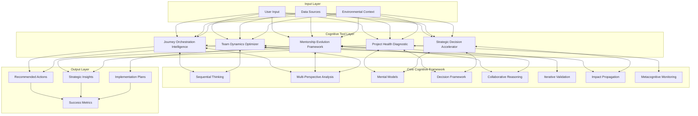
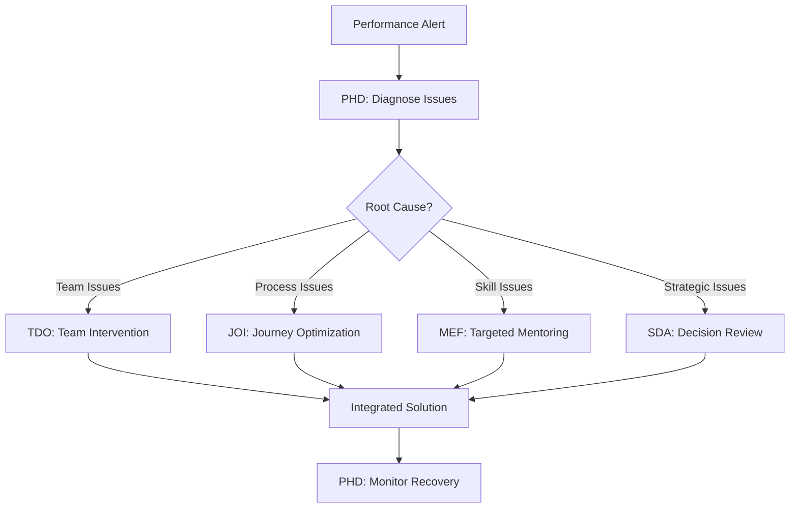
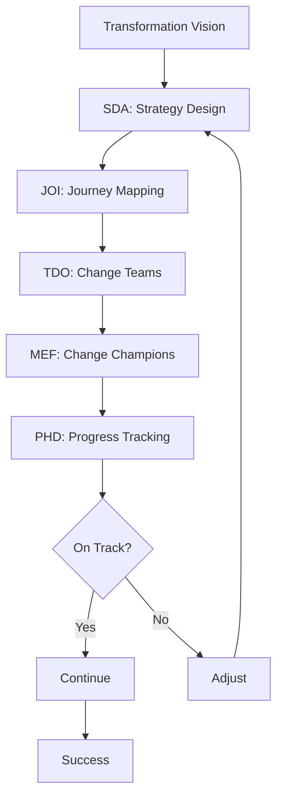

# Integrated Cognitive Tool Ecosystem

## Master Integration Architecture



## Tool Synergy Matrix

| Tool | JOI | PHD | MEF | TDO | SDA | Value Multiplication |
|------|-----|-----|-----|-----|-----|---------------------|
| **JOI** | - | Health impacts journey | Mentee journey design | Team member journeys | Decision rollout paths | Journey intelligence across all domains |
| **PHD** | Journey health tracking | - | Mentoring program health | Team health monitoring | Decision health checks | Comprehensive health visibility |
| **MEF** | Mentor journey optimization | Project mentor matching | - | Peer mentoring networks | Decision mentor guidance | Distributed wisdom network |
| **TDO** | Team journey design | Team health diagnosis | Team mentoring culture | - | Team decision dynamics | Optimized human systems |
| **SDA** | Decision journey mapping | Decision health tracking | Mentor decision support | Team decision optimization | - | Accelerated strategic choices |

## Integrated Workflows

### Workflow 1: New Project Launch


### Workflow 2: Performance Crisis Response


### Workflow 3: Organizational Transformation


## Data Flow Architecture

```yaml
Shared Data Lake:
  - User Profiles
  - Project Data
  - Team Information
  - Historical Patterns
  - Success Metrics

Tool-Specific Enrichment:
  JOI:
    - Journey Maps
    - Touchpoint Data
    - Experience Metrics
  
  PHD:
    - Health Scores
    - Diagnostic History
    - Intervention Results
  
  MEF:
    - Mentoring Relationships
    - Growth Trajectories
    - Knowledge Transfer
  
  TDO:
    - Team Dynamics
    - Collaboration Patterns
    - Performance Metrics
  
  SDA:
    - Decision Trees
    - Outcome Tracking
    - Learning Loops

Cross-Tool Intelligence:
  - Pattern Recognition
  - Predictive Models
  - Best Practice Library
  - Failure Prevention
  - Success Amplification
```

## Value Creation Mechanisms

### 1. Compound Learning
Each tool learns from others' experiences:
- JOI learns optimal paths from PHD diagnostics
- PHD improves predictions from TDO team patterns
- MEF enhances matching from SDA decision styles
- TDO optimizes using MEF growth data
- SDA accelerates using JOI journey insights

### 2. Preventive Intelligence
Tools warn each other of issues:
- PHD alerts TDO of team stress
- TDO warns JOI of journey bottlenecks
- JOI signals MEF about development needs
- MEF notifies SDA of capability gaps
- SDA informs PHD of strategic risks

### 3. Amplification Effects
Success in one area boosts others:
- Better decisions (SDA) → Healthier projects (PHD)
- Stronger teams (TDO) → Smoother journeys (JOI)
- Effective mentoring (MEF) → Better decisions (SDA)
- Optimized journeys (JOI) → Higher performance (TDO)
- Healthy projects (PHD) → Successful mentoring (MEF)

## Implementation Roadmap

### Phase 1: Foundation (Months 1-3)
- Deploy individual tools
- Establish data connections
- Create basic integrations
- Train initial users
- Measure baseline metrics

### Phase 2: Integration (Months 4-6)
- Build cross-tool workflows
- Implement shared learning
- Create unified dashboards
- Develop best practices
- Scale user adoption

### Phase 3: Intelligence (Months 7-9)
- Activate predictive features
- Enable preventive alerts
- Implement amplification
- Automate optimizations
- Measure compound value

### Phase 4: Evolution (Months 10-12)
- Continuous improvement
- Advanced AI features
- Ecosystem expansion
- Knowledge multiplication
- Strategic advantage

## Success Metrics

### Individual Tool Metrics
- Adoption rates
- User satisfaction
- Time savings
- Quality improvements
- ROI achievement

### Integration Metrics
- Cross-tool usage
- Workflow completion
- Handoff efficiency
- Data sharing volume
- Pattern recognition

### Ecosystem Metrics
- Compound value creation
- Predictive accuracy
- Prevention effectiveness
- Amplification factor
- Strategic impact