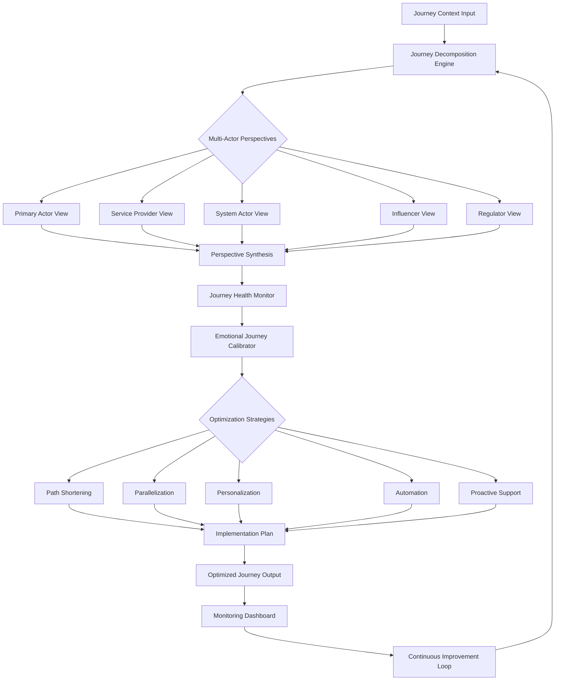
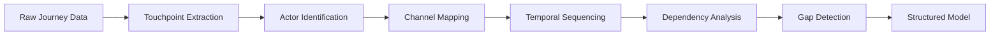
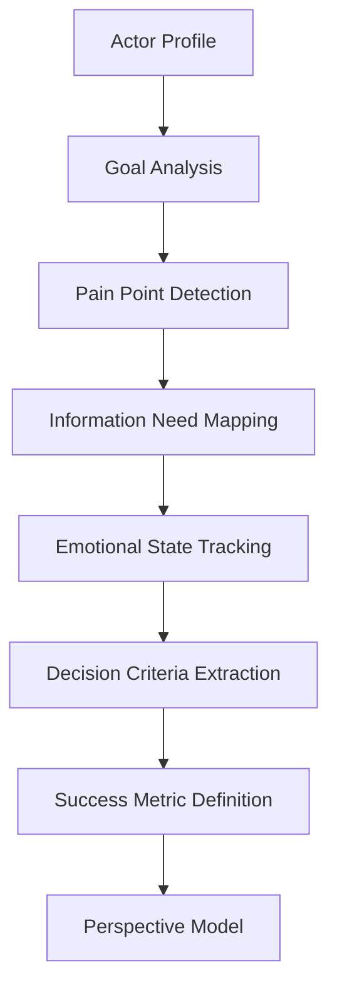
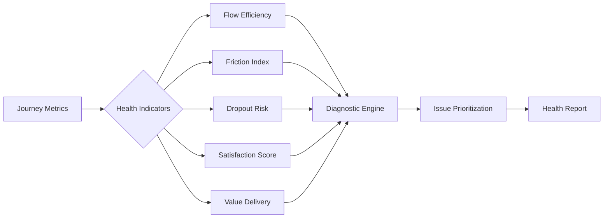

# Journey Orchestration Workflow Diagram

## High-Level Workflow



## Detailed Component Workflows

### Journey Decomposition Engine



### Multi-Actor Perspective Analysis



### Journey Health Monitoring



## Data Flow Architecture

```yaml
Input Layer:
  - Journey Documentation
  - Analytics Data
  - User Feedback
  - System Logs
  - Observation Data

Processing Layer:
  - Decomposition Services
  - Perspective Generators
  - Health Calculators
  - Emotion Analyzers
  - Optimization Engines

Intelligence Layer:
  - Pattern Recognition
  - Anomaly Detection
  - Predictive Modeling
  - Recommendation Engine
  - Impact Simulation

Output Layer:
  - Visual Journey Maps
  - Actor Guides
  - Health Dashboards
  - Action Plans
  - ROI Projections
```

## Integration Points

### With Existing Cognitive Tools:
1. **Multi-Perspective Analysis**: For stakeholder viewpoint synthesis
2. **Decision Framework**: For optimization strategy selection
3. **Impact Propagation**: For change impact prediction
4. **Sequential Thinking**: For journey stage progression
5. **Iterative Validation**: For continuous improvement

### With External Systems:
1. **Analytics Platforms**: Real-time data ingestion
2. **CRM Systems**: Customer data integration
3. **Project Management Tools**: Implementation tracking
4. **Communication Platforms**: Stakeholder updates
5. **BI Dashboards**: Performance monitoring